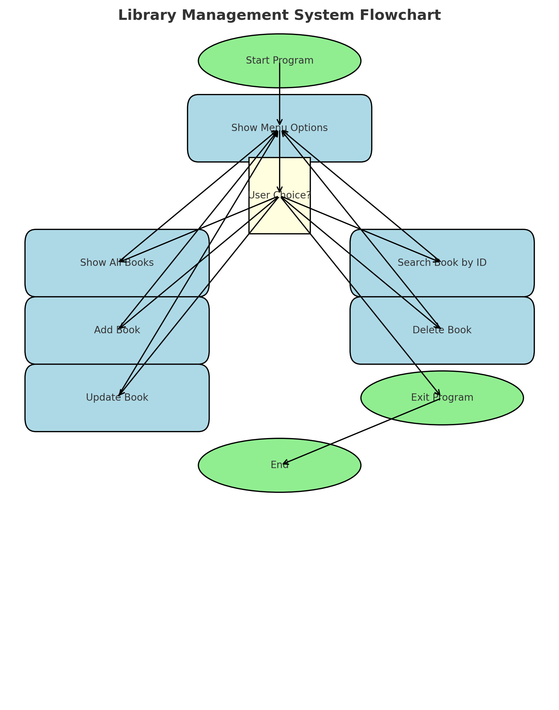

# 📚 Library Management System (C++)

A simple **console-based library management system** written in **C++** using file handling.
It allows users to **add, view, search, update, and delete** books stored in a text file (`bookData.txt`).

---

## 🚀 Features

* **Add Book** → Enter Book ID, Name, and Author, store it in `bookData.txt`.
* **Show All Books** → Display all stored books in a tabular format.
* **Search Book by ID** → Search a book by its ID and display details.
* **Update Book** → Modify book name and author for an existing ID.
* **Delete Book** → Remove a book from the library using its ID.
* **Exit** → Close the program safely.

---

## 📂 Project Structure

```
Library-Management/
│── library.cpp        # Main program file
│── bookData.txt       # Storage file (auto-created on first run)
│── README.md          # Documentation
│── library_flowchart.png # Workflow diagram
```

---

## ⚙️ Requirements

* **C++ compiler** (e.g., g++, MinGW, or MSVC)

---

## 🖥️ Usage

### 1️⃣ Compile the Program

```bash
g++ library.cpp -o library
```

### 2️⃣ Run the Executable

```bash
./library
```

---

## 📝 Menu Options

When you run the program, you’ll see:

```
========== Library Management ==========
1. Show All Books
2. Search Book by ID
3. Add Book
4. Delete Book
5. Update Book
6. Exit
========================================
Enter your choice:
```

### Example Operations:

* **Add Book** → Adds entry to `bookData.txt` as `ID*Name*Author`.
* **Show All Books** → Displays formatted list of all books.
* **Delete/Update** → Creates a temporary file and replaces `bookData.txt` with updated content.

---

## 🔄 Workflow Diagram



---

## 🔒 Notes

* Book data is stored in `bookData.txt` in the format:

  ```
  ID*Book Name*Author
  ```
* Temporary file `temp.txt` is used for update/delete operations.
* Ensure `bookData.txt` is in the same directory as the program.

---

## 🛠️ Future Improvements

* Add user authentication (librarian login).
* Track book borrowing and returning.
* Store additional fields (e.g., publication year, genre).
* Use database (SQLite/MySQL) instead of text file for scalability.
